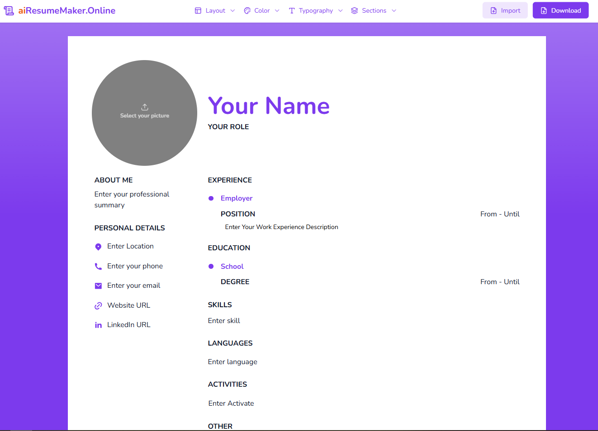

# aiResumeMaker


aiResumeMaker is an AI-powered tool designed to simplify and enhance the resume creation process. It helps users generate professional, tailored resumes by leveraging advanced AI algorithms to optimize content, format, and style. Whether you're a student, experienced professional, or career changer, aiResumeMaker provides smart suggestions, pre-designed templates, and industry-specific keywords to make your resume stand out. With an intuitive interface and time-saving features, aiResumeMaker ensures you create a compelling resume effortlessly.

---

## Table of Contents
- [Installation](#installation)
- [Usage](#usage)
- [Features](#features)
- [Contributing](#contributing)
- [License](#license)
- [Deployed Link](#deployed-link)

---

## Installation

Provide clear instructions to install your project. For example:

```bash
# Clone the repository
git clone https://github.com/topdev126/AiResumeMaker.git

# Navigate to the project directory
cd yourproject

# Install dependencies
npm install
```

---

## Usage




---

## Features

List key features of your project:
- Import & Edit Resume
- Create new Resume
- Download Resume
- AI powered Resume

---

## Contributing

Explain how others can contribute to your project:

1. Fork the repository
2. Create a new branch
3. Make your changes
4. Submit a pull request

---

## License

Specify your project license. For example:

This project is licensed under the MIT License - see the [LICENSE](LICENSE) file for details.

---
## Deployed Link

Check out the live version of the project: [Deployed Link](https://resumemakerbuilder.onrender.com/)

---
## Contact

For questions or suggestions, reach out:
- Email: speedifytv@gmail.com
